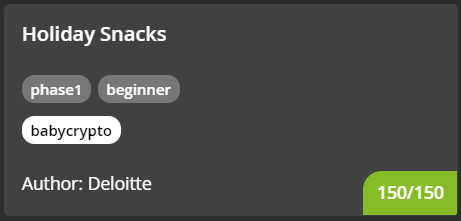
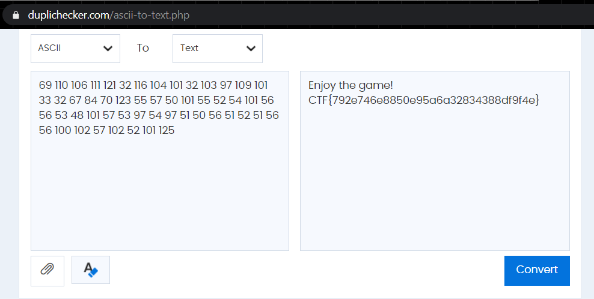

#### CHALLENGE INFORMATION

We've got some snacks for you to get you started, or when you want to take a break!

*Author information: This challenge is developed by Deloitte.*

---

#### (25 Points) SNACK 1

Time to warm up! Decode this:

```
69 110 106 111 121 32 116 104 101 32 103 97 109 101 33 32 67 84 70 123 55 57 50 101 55 52 54 101 56 56 53 48 101 57 53 97 54 97 51 50 56 51 52 51 56 56 100 102 57 102 52 101 125
```

Flag format: CTF{32-hex}

#### (Solution) SNACK 1

Looks like ASCII codes.

Use any online ASCII-to-text converter such as https://www.duplichecker.com/ascii-to-text.php :



#### (Flag) Snack 2

```
CTF{792e746e8850e95a6a32834388df9f4e}
```

---

#### (25 Points) SNACK 2

Decode this:

```
ppaHaH ykkun !harreMhC ytsir!sampaH N ypY we!raevaH  a egalfFTC d10{fbf6f6257784459adb3abbcccf22 .}6 uoYesed evr!!ti
```

Flag format: CTF{32-hex}

#### (Solution) SNACK 2

Looks like there are some blocks of characters in reverse.

<code><mark>ppaH</mark>aH ykkun !harreMhC ytsir!sampaH N ypY we!raevaH  a egalf<mark>FTC</mark> d10{fbf6f6257784459adb3abbcccf22 .}6 uoYesed evr!!ti</code>

E.g.

- `ppaH` is part of *Happy* in reverse
- `FTC` is *CTF* in reverse

Seems like the original string has been broken up into blocks of 4 characters and each block is in reverse.

We can write a simple Python code to reverse this:

```python
s = 'ppaHaH ykkun !harreMhC ytsir!sampaH N ypY we!raevaH  a egalfFTC d10{fbf6f6257784459adb3abbcccf22 .}6 uoYesed evr!!ti'
n = 4
splitted_s = [string[i:i+n] for i in range(0, len(string), n)]
reversed_s = [i[::-1] for i in splitted]
flag = ''.join(reversed_s)
print(flag)
```

Output:

```
Happy Hanukkah! Merry Christmas! Happy New Year! Have a flag CTF{01d6fbf526f4877a954a3bdccbb22fc6}. You deserve it!!
```

#### (Flag) Snack 2

```
CTF{01d6fbf526f4877a954a3bdccbb22fc6}
```

---

#### (25 Points) SNACK 3

Decode this:

```
789c0bc9485548cb494c57c82c56700e71ab3631b34c354e3133b734364e49b130374b344bb348b24c33b1484d4e334f3635a9e5020083360ec2
```

Flag format: CTF{32-hex}

#### (Solution) SNACK 3

At first glance it looks like a base64. However, try to decode from Base64 yields an incorrect answer.

Looking at the first few characters, we noticed that it has the [signature](https://en.wikipedia.org/wiki/List_of_file_signatures) of a *zlib* file which is a file compression format.

We can use the `zlib` library in Python to decompress but remember to convert it to bytes first.

```python
import zlib
h = '789c0bc9485548cb494c57c82c56700e71ab3631b34c354e3133b734364e49b130374b344bb348b24c33b1484d4e334f3635a9e5020083360ec2'
b = bytes.fromhex(s)
print(zlib.decompress(b))
```

Output:

```
b'The flag is CTF{469e3d67933dd876a6f8b9f48ecf7c54}\n'
```

#### (Flag) Snack 3

```
CTF{469e3d67933dd876a6f8b9f48ecf7c54}
```

---

#### (25 Points) SNACK 4

Decode this:

```
4gw22559BUW013u2PVCWzWRLZCw6K1SPP6RQ7
w31IVPVXw04SWREVd0qeJ5jx8qAPsW7f5PdeJ
```

Flag format: CTF{32-hex}

#### (Solution) SNACK 4

2 lines of strings are provided hinting there should be some sort of binary operation between the two. Also notice that the each line has 38 characters which is the same as that of the flag. 

We shall test the first 3 characters of each string to see if we could reach the characters `CTF`. Let's convert it to binary first using https://www.rapidtables.com/convert/number/ascii-to-binary.html

```
# convert '4gw' from ASCII to binary
01000011 01010100 01000110

# convert 'w31' from ASCII to binary
01110111 00110011 00110001

# convert 'CTF' from ASCII to binary
01000011 01010100 01000110
```

Now, it is clear that in order to get the string `CTF`, we take the result of the *XOR*  operation between `4gw` and `w31`.

Therefore, we can write a simple Python script to get the flag.

```python
a = '4gw22559BUW013u2PVCWzWRLZCw6K1SPP6RQ7'
b = 'w31IVPVXw04SWREVd0qeJ5jx8qAPsW7f5PdeJ'

# convert from ASCII to binary
a_bin = bin(int.from_bytes(a.encode(), 'big'))
b_bin = bin(int.from_bytes(b.encode(), 'big'))

# XOR operation
flag_bin = int(a_bin,2) ^ int(b_bin,2)

# convert from binary to ASCII
flag = flag_bin.to_bytes((flag_bin.bit_length() + 7) // 8, 'big').decode()

print(flag)
```

#### (Flag) Snack 4

```
CTF{deca5eccfa0d4f220b84b26f8fd6ef64}
```

---

#### (50 Points) SNACK 5

Decode this:

```
9352663 86 8447 2278873 843 3524 38368 93 4673 968 9455 4283 2 47328 8463 843 62442 9673 47 44643727323
```

Flag format: magic-word

*Hint: have a look at your phone. All words are part of standard English dictionaries.*

#### (Solution) SNACK 5

Given the clue, this hints of using SMS using a number keypad.

Fortunately, we can use https://www.dcode.fr/t9-cipher

#### (Flag) Snack 5

```
GINGERBREAD
```

