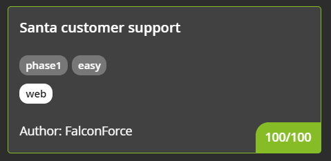
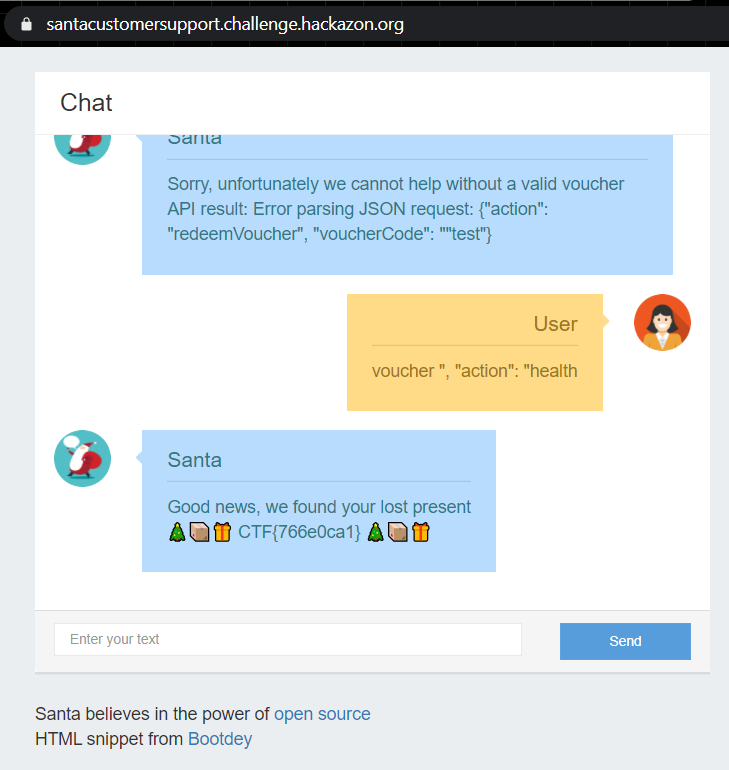

#### CHALLENGE INFORMATION

Did you lose any gifts and need to find it again? We offer customer support!

*Author information: This challenge is developed by Gijs from FalconForce.*

#### BACKEND SYSTEMS (SHARED)

Backend systems are running for you.
This environment will run until 2021-12-10 13:24:09 CET

**Note: the infrastructure of this challenge is shared between multiple players, please be careful.**

Use the following link to access the challenge:
https://santacustomersupport.challenge.hackazon.org/

#### (100 Points) RECOVER YOUR LOST GIFT

Santa provides a chat service in case you lose any gifts. Can you find your gift back?

---

#### (Solution) RECOVER YOUR LOST GIFT

Entering into the link reveals a chat bot. We tested a random entry at it replies as follows:


At the bottom, we see a link. A copy of the html can be found [here](./src/source.html).

Let's check the link.

```python
import sys, os
from flask import Flask, render_template, request, jsonify
import random
import backend_api

app = Flask(__name__)
flag = os.environ['FLAG']

@app.route("/")
def index():
    return render_template("chat.html")

keywords = {
        ('gift', 'present'): 'If you are contacting us regarding a lost or misplaced gift.\nPlease make sure you present your unique gift voucher code by entering voucher <voucher-code>',
        ('sing', 'song', 'jingle bells'): "It's Christmas\nJingle bells, jingle bells\nJingle all the way\nOh, what fun it is to ride\nIn a one horse open sleigh",
        ('help', ): 'You can ask me about your presents or ask me to sing a song',
        ('hi', 'hello'): 'Nice to meet you! My name is Santa!'
}
rnd = [
        'Hohoho merry x-mas',
        'You can make inquiries here about any lost of misplaced gifts',
]

@app.route("/message", methods = ["POST"])
def msg():
    msg = request.form.get('message', '')
    if msg.lower().startswith('voucher '):
        voucher = msg.split(' ',1)[1]
        return jsonify(process(voucher))
    for k,v in keywords.items():
        for w in k:
            if w in msg.lower():
                return jsonify(v)
    return jsonify(random.choice(rnd))

@app.route("/source")
def source():
    return os.popen("source-highlight -i /app/main.py -o STDOUT").read()

@app.route("/health")
def health():
    res = backend_api.post(data="{\"action\": \"health\"}")
    if res.status_code == backend_api.STATUS_OK:
        return jsonify(santa_status='UP', voucher_backend='UP')
    return jsonify(santa_status='UP', voucher_backend='DOWN')

# Santa is a micro-services kind of guy so the voucher
# validation is running as a seperate service that we interact with
# via POST requests
def process(voucher):
    res = backend_api.post(data="{\"action\": \"redeemVoucher\", \"voucherCode\": \"" + voucher + "\"}")
    if res.status_code == backend_api.STATUS_OK:
        return f"Good news, we found your lost present\n🎄📦🎁 {flag} 🎄📦🎁"
    return f"Sorry, unfortunately we cannot help without a valid voucher\nAPI result: {res.data}"
```

It is basically a Python script that works on the backend to provide a response for the chatbot.

We can see that the response can be found in the list `rnd`.

The flag can be retrieved only on the second last line, `return f"Good news, we found your lost present\n🎄📦🎁 {flag} 🎄📦🎁"`

Let's work backwards:

1. It needs to be satisfied by the `if` condition `res.status_code == backend_api.STATUS_OK`,
   - where `res` is a the response of the `post` request given by the line  `res = backend_api.post(data="{\"action\": \"redeemVoucher\", \"voucherCode\": \"" + voucher + "\"}")`.
   - All of which is defined the function `process(voucher)`.

2. The function `process` is then called by the function `msg()` which seems to be the handler for the messages in the chatbot. 

3. In the `msg()` function, we also know that we need to enter the keyword "voucher" followed by the voucher-code.

**Objective: **Now all, we have to do is to trick the program into satisfying the `if` condition.

Since the voucher-code is stored in the variable `voucher` we can make some calculated guesses for the inputs.

I figured, we can start off with `voucher "test` as our input and true enough it did reveal a vulnerability:


Now, looking back at the source code we noticed this snippet here:

```python
@app.route("/health")
def health():
    res = backend_api.post(data="{\"action\": \"health\"}")
    if res.status_code == backend_api.STATUS_OK:
        return jsonify(santa_status='UP', voucher_backend='UP')
    return jsonify(santa_status='UP', voucher_backend='DOWN')
```

Can we somehow use the above to trick the JSON parser?

Let's try the following input:

```
voucher ", "action": "health
```

Yes, we got the flag!



Flag:

```
CTF{766e0ca1}
```