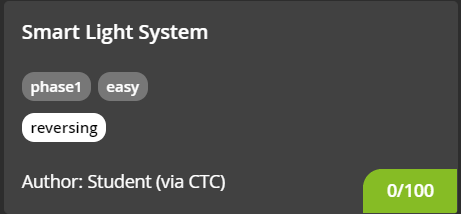

#### CHALLENGE INFORMATION

They also have smart homes on the North Pole!

*Author information: This challenge is developed by Zawadi, a student who participates in Challenge the Cyber.*

#### FILES

You will need the files below in order to solve this challenge.

[firmware](./src/firmware)

#### (100 Points) SMART LIGHT SYSTEM

To enable the Smart Light System the "embedded key" is needed!

*Note: we made a bugfix to the firmware binary on 13 December, please re-download.*

---

#### (Solution) SMART LIGHT SYSTEM

Running the file:

```
$ ./src/firmware
💽 Initializing firmware 💽
🔑 Reading key 🔑

```

Enter some random input:

```
💽 Initializing firmware 💽
🔑 Reading key 🔑
testing_some_random_input
Checking license
⭕ Key is invalid ⭕
```

Since this is a 'reversing' challenge, we probably need to use GDB.

First, let's check the file type on the binary:

```
$ file ./src/firmware
./src/firmware: ELF 64-bit LSB executable, x86-64, version 1 (GNU/Linux), statically linked, for GNU/Linux 2.6.32, BuildID[sha1]=05b1b3c94310d7474e4aa24c8a61eef00e8d57a3, stripped
```

This shows that the binary is stripped. When a program is compiled, the compiler adds extra information to the binary called debugging symbols. These symbols makes it easier to debug a program. A stripped binary is a program that is compiled with a *strip* flag that tells the compiler to discard these debugging symbols and compile to program as it is. Stripping a binary reduces its size on the disk and makes it a little more difficult to debug and reverse engineer it.

Passing the file in GDB confirms that there are no symbols:

```
$ gdb ./src/firmware
Reading symbols from ./src/firmware...
(No debugging symbols found in ./src/firmware)
```

The first logical step would be to find the entry point. This can be done by running “*info file*” in GDB:

```
gdb-peda$ info file
Symbols from "/mnt/d/Deloitte_Hacky_Holidays_CTF/PHASE 1/Smart Light System/src/firmware".
Local exec file:
        `/mnt/d/Deloitte_Hacky_Holidays_CTF/PHASE 1/Smart Light System/src/firmware', file type elf64-x86-64.
        Entry point: 0x400890
        0x0000000000400190 - 0x00000000004001b0 is .note.ABI-tag
        0x00000000004001b0 - 0x00000000004001d4 is .note.gnu.build-id
        0x00000000004001d8 - 0x00000000004002c8 is .rela.plt
        0x00000000004002c8 - 0x00000000004002e2 is .init
        0x00000000004002f0 - 0x0000000000400390 is .plt
        0x0000000000400390 - 0x000000000049f414 is .text
        0x000000000049f420 - 0x00000000004a1949 is __libc_freeres_fn
        0x00000000004a1950 - 0x00000000004a1a2e is __libc_thread_freeres_fn
        0x00000000004a1a30 - 0x00000000004a1a39 is .fini
        0x00000000004a1a40 - 0x00000000004bee64 is .rodata
        0x00000000004bee68 - 0x00000000004beeb8 is __libc_subfreeres
        0x00000000004beeb8 - 0x00000000004beec0 is __libc_atexit
        0x00000000004beec0 - 0x00000000004beec1 is .stapsdt.base
        0x00000000004beec8 - 0x00000000004beed0 is __libc_thread_subfreeres
        0x00000000004beed0 - 0x00000000004ca03c is .eh_frame
        0x00000000004ca03c - 0x00000000004ca0fe is .gcc_except_table
        0x00000000006caeb8 - 0x00000000006caed8 is .tdata
        0x00000000006caed8 - 0x00000000006caf08 is .tbss
        0x00000000006caed8 - 0x00000000006caee8 is .init_array
        0x00000000006caee8 - 0x00000000006caef8 is .fini_array
        0x00000000006caef8 - 0x00000000006caf00 is .jcr
        0x00000000006caf00 - 0x00000000006cafe4 is .data.rel.ro
        0x00000000006cafe8 - 0x00000000006caff8 is .got
        0x00000000006cb000 - 0x00000000006cb068 is .got.plt
        0x00000000006cb080 - 0x00000000006ccb50 is .data
        0x00000000006ccb60 - 0x00000000006ce3d8 is .bss
        0x00000000006ce3d8 - 0x00000000006ce408 is __libc_freeres_ptrs
```

We can see that the entry point is at ***0x400890***. Let's set a break point there and run the program.

```
gdb-peda$ break *0x400890
Breakpoint 1 at 0x400890
gdb-peda$ r
Starting program: /mnt/d/Deloitte_Hacky_Holidays_CTF/PHASE 1/Smart Light System/src/firmware
[----------------------------------registers-----------------------------------]
RAX: 0x0
RBX: 0x0
RCX: 0x0
RDX: 0x0
RSI: 0x0
RDI: 0x0
RBP: 0x0
RSP: 0x7ffffffedb30
RIP: 0x400890 --> 0x89485ed18949ed31
R8 : 0x0
R9 : 0x0
R10: 0x0
R11: 0x0
R12: 0x0
R13: 0x0
R14: 0x0
R15: 0x0
EFLAGS: 0x202 (carry parity adjust zero sign trap INTERRUPT direction overflow)
[-------------------------------------code-------------------------------------]
   0x400882:    mov    rbp,rax
   0x400885:    jmp    0x400641
   0x40088a:    nop    WORD PTR [rax+rax*1+0x0]
=> 0x400890:    xor    ebp,ebp
   0x400892:    mov    r9,rdx
   0x400895:    pop    rsi
   0x400896:    mov    rdx,rsp
   0x400899:    and    rsp,0xfffffffffffffff0
[------------------------------------stack-------------------------------------]
Invalid $SP address: 0x7ffffffedb30
[------------------------------------------------------------------------------]
Legend: code, data, rodata, value

Breakpoint 1, 0x0000000000400890 in ?? ()
```

Great. Let's disassemble this region:

```
gdb-peda$ disassemble
No function contains program counter for selected frame.
```

We can’t simply use *disassemble* to disassemble this region. This is because GDB does not know the range of the function we want to disassemble. We can overcome this by printing a number of instructions starting from the program counter as the program counter points to the next instruction to execute. Let’s use `x/15i $rip` which will print 15 instruction starting from *rip* (64-bit).

```
gdb-peda$ x/15i $rip
=> 0x400890:    xor    ebp,ebp
   0x400892:    mov    r9,rdx
   0x400895:    pop    rsi
   0x400896:    mov    rdx,rsp
   0x400899:    and    rsp,0xfffffffffffffff0
   0x40089d:    push   rax
   0x40089e:    push   rsp
   0x40089f:    mov    r8,0x401ba0
   0x4008a6:    mov    rcx,0x401b10
   0x4008ad:    mov    rdi,0x400d98
   0x4008b4:    call   0x401650
   0x4008b9:    hlt
   0x4008ba:    nop    WORD PTR [rax+rax*1+0x0]
   0x4008c0:    mov    eax,0x6ccb57
   0x4008c5:    push   rbp
```

Keep in mind that this is the entry point and not the main() function. Now we have to find where main() is. At instruction ***0x4008b4*** we see a `call` instruction. 

We can safely assume that this process calls `__libc_start_main` function with the appropriate parameters.

<u> Also note, the first parameter of `__libc_start_main` function is the address of the actual `main()` function. Therefore, since arguments are pushed in reverse order, the address to main is ***0x400d98***.</u>

Let's set a break point at this address and continue the execution.

```
gdb-peda$ break *0x400d98
Breakpoint 2 at 0x400d98
gdb-peda$ c
Continuing.
[----------------------------------registers-----------------------------------]
RAX: 0x400d98 --> 0x60ec8348e5894855
RBX: 0x4002c8 --> 0x1d058b4808ec8348
RCX: 0x6
RDX: 0x7ffffffedb48 --> 0x7ffffffedd92 ("SHELL=/bin/bash")
RSI: 0x7ffffffedb38 --> 0x7ffffffedd47 ("/mnt/d/Deloitte_Hacky_Holidays_CTF/PHASE 1/Smart Light System/src/firmware")
RDI: 0x1
RBP: 0x6cb018 --> 0x43ba80 (mov    rcx,rsi)
RSP: 0x7ffffffeda08 --> 0x4010a6 (mov    edi,eax)
RIP: 0x400d98 --> 0x60ec8348e5894855
R8 : 0x2
R9 : 0x6
R10: 0x9e
R11: 0xb ('\x0b')
R12: 0x401b10 (push   r14)
R13: 0x401ba0 (push   rbx)
R14: 0x0
R15: 0x0
EFLAGS: 0x246 (carry PARITY adjust ZERO sign trap INTERRUPT direction overflow)
[-------------------------------------code-------------------------------------]
   0x400d91:    call   0x4438b0
   0x400d96:    leave
   0x400d97:    ret
=> 0x400d98:    push   rbp
   0x400d99:    mov    rbp,rsp
   0x400d9c:    sub    rsp,0x60
   0x400da0:    mov    rax,QWORD PTR fs:0x28
   0x400da9:    mov    QWORD PTR [rbp-0x8],rax
[------------------------------------stack-------------------------------------]
0000| 0x7ffffffeda08 --> 0x4010a6 (mov    edi,eax)
0008| 0x7ffffffeda10 --> 0x38000000380
0016| 0x7ffffffeda18 --> 0x100000380
0024| 0x7ffffffeda20 --> 0x7ffffffedb38 --> 0x7ffffffedd47 ("/mnt/d/Deloitte_Hacky_Holidays_CTF/PHASE 1/Smart Light System/src/firmware")
0032| 0x7ffffffeda28 --> 0x400d98 --> 0x60ec8348e5894855
0040| 0x7ffffffeda30 --> 0x4002c8 --> 0x1d058b4808ec8348
0048| 0x7ffffffeda38 --> 0xf2dc70a6a47e5a46
0056| 0x7ffffffeda40 --> 0x401b10 (push   r14)
[------------------------------------------------------------------------------]
Legend: code, data, rodata, value

Breakpoint 2, 0x0000000000400d98 in ?? ()
```

Let’s disassemble the region using `x/50i $rip` command to display the first 50 instructions (up till `ret`).

```
gdb-peda$ x/50i $rip
=> 0x400d98:    push   rbp
   0x400d99:    mov    rbp,rsp
   0x400d9c:    sub    rsp,0x60
   0x400da0:    mov    rax,QWORD PTR fs:0x28
   0x400da9:    mov    QWORD PTR [rbp-0x8],rax
   0x400dad:    xor    eax,eax
   0x400daf:    mov    edi,0x4a1a70
   0x400db4:    call   0x410470               
   0x400db9:    call   0x400c78
   0x400dbe:    test   eax,eax
   0x400dc0:    jne    0x400e32
   0x400dc2:    mov    edi,0x4a1a90
   0x400dc7:    call   0x410470
   0x400dcc:    lea    rax,[rbp-0x50]
   0x400dd0:    mov    edx,0x40
   0x400dd5:    mov    rsi,rax
   0x400dd8:    mov    edi,0x0
   0x400ddd:    call   0x43fee0
   0x400de2:    lea    rax,[rbp-0x50]
   0x400de6:    mov    rdi,rax
   0x400de9:    call   0x4009ae
   0x400dee:    mov    DWORD PTR [rbp-0x54],eax
   0x400df1:    mov    edi,0x4a1aa6
   0x400df6:    call   0x410470
   0x400dfb:    cmp    DWORD PTR [rbp-0x54],0x0
   0x400dff:    jne    0x400e21
   0x400e01:    mov    edi,0x4a1ab7
   0x400e06:    call   0x410470
   0x400e0b:    mov    edi,0x4a1ad0
   0x400e10:    call   0x410470
   0x400e15:    mov    edi,0x4a1af1
   0x400e1a:    call   0x410470
   0x400e1f:    jmp    0x400e2b
   0x400e21:    mov    edi,0x4a1b06
   0x400e26:    call   0x410470
   0x400e2b:    mov    eax,0x0
   0x400e30:    jmp    0x400e41
   0x400e32:    mov    edi,0x4a1b1d
   0x400e37:    call   0x410470
   0x400e3c:    mov    eax,0x0
   0x400e41:    mov    rcx,QWORD PTR [rbp-0x8]
   0x400e45:    xor    rcx,QWORD PTR fs:0x28
   0x400e4e:    je     0x400e55
   0x400e50:    call   0x4438b0
   0x400e55:    leave
   0x400e56:    ret
   0x400e57:    nop    WORD PTR [rax+rax*1+0x0]
   0x400e60:    push   r14
   0x400e62:    push   r13
   0x400e64:    mov    eax,0x0
```

This is the part where we have to do some trial and error.

For the first run, we shall step through each instruction using the command: `ni` and observe the output of the program until it ends.

We noticed the following:

- at `0x400db4`, the program prints: `💽 Initializing firmware 💽`
- at `0x400dc0`, the program jumps to `0x400e32`. This implies that the previous instruction `test   eax,eax` does not return 0. (https://en.wikipedia.org/wiki/TEST_(x86_instruction))
- at `0x400e37`, the program prints: `🚨 Attacker detected 🚨`

Based on the observations above, we can insert some comments at the main:

```
=> 0x400d98:    push   rbp
   0x400d99:    mov    rbp,rsp
   0x400d9c:    sub    rsp,0x60
   0x400da0:    mov    rax,QWORD PTR fs:0x28
   0x400da9:    mov    QWORD PTR [rbp-0x8],rax
   0x400dad:    xor    eax,eax
   0x400daf:    mov    edi,0x4a1a70
   0x400db4:    call   0x410470					# prints "💽 Initializing firmware 💽"
   0x400db9:    call   0x400c78
   0x400dbe:    test   eax,eax					# sets ZF to 1 if eax == 0
   0x400dc0:    jne    0x400e32					# jumps if ZF != 1
   0x400dc2:    mov    edi,0x4a1a90
   0x400dc7:    call   0x410470
   0x400dcc:    lea    rax,[rbp-0x50]
   0x400dd0:    mov    edx,0x40
   0x400dd5:    mov    rsi,rax
   0x400dd8:    mov    edi,0x0
   0x400ddd:    call   0x43fee0
   0x400de2:    lea    rax,[rbp-0x50]
   0x400de6:    mov    rdi,rax
   0x400de9:    call   0x4009ae
   0x400dee:    mov    DWORD PTR [rbp-0x54],eax
   0x400df1:    mov    edi,0x4a1aa6
   0x400df6:    call   0x410470
   0x400dfb:    cmp    DWORD PTR [rbp-0x54],0x0
   0x400dff:    jne    0x400e21
   0x400e01:    mov    edi,0x4a1ab7
   0x400e06:    call   0x410470
   0x400e0b:    mov    edi,0x4a1ad0
   0x400e10:    call   0x410470
   0x400e15:    mov    edi,0x4a1af1
   0x400e1a:    call   0x410470
   0x400e1f:    jmp    0x400e2b
   0x400e21:    mov    edi,0x4a1b06
   0x400e26:    call   0x410470
   0x400e2b:    mov    eax,0x0
   0x400e30:    jmp    0x400e41
   0x400e32:    mov    edi,0x4a1b1d
   0x400e37:    call   0x410470					# prints "🚨 Attacker detected 🚨"
   0x400e3c:    mov    eax,0x0
   0x400e41:    mov    rcx,QWORD PTR [rbp-0x8]
   0x400e45:    xor    rcx,QWORD PTR fs:0x28
   0x400e4e:    je     0x400e55
   0x400e50:    call   0x4438b0
   0x400e55:    leave
   0x400e56:    ret
   0x400e57:    nop    WORD PTR [rax+rax*1+0x0]
   0x400e60:    push   r14
   0x400e62:    push   r13
   0x400e64:    mov    eax,0x0
```

Therefore, at this stage we need to set `eax` to 0 before the jump instruction. Let's set the break point at `0x400dbe` and re-run.

```
$ run
Breakpoint 1, 0x0000000000400890 in ?? ()
$ c
Breakpoint 2, 0x0000000000400d98 in ?? ()
$ c
Breakpoint 3, 0x0000000000400dbe in ?? ()
```

At this stage, we are at `=> 0x400dbe:    test   eax,eax` instruction.

Checking the registers using the command `info registers` indeed shows that `eax` is not equal to 0 (`eax` is just the 32-bit portion of `rax`) :

```
gdb-peda$ info registers
rax            0x1                 0x1
```

Let's set `rax` (or `eax`) register to be equal to 0:

```
gdb-peda$ set $rax=0
gdb-peda$ info registers
rax            0x0                 0x0
```

Now, stepping through the program (`ni`) at  `0x400dc0:    jne    0x400e32` will not result in a jump like before. Instead, it will proceed to the next instruction at `0x400dc2`.

Similarly, we shall step through each instruction using the command: `ni` and observe the output of the program until it ends.

We noticed the following:

- at `0x400dc7`, the program prints: `🔑 Reading key 🔑`
- at `0x400ddd`, the program requests for user input. We shall enter some random string: `TracesOfNuts`
- at `0x400df6`, the program prints: `Checking license`
- at `0x400dff`, the program jumps to `0x400e21`. This implies that the previous instruction `0x400dfb:    cmp    DWORD PTR [rbp-0x54],0x0` does not return 0.
- at `0x400e26`, the program prints: `⭕ Key is invalid ⭕`

Based on the observations above, we can insert some comments at the main:

```
=> 0x400d98:    push   rbp
   0x400d99:    mov    rbp,rsp
   0x400d9c:    sub    rsp,0x60
   0x400da0:    mov    rax,QWORD PTR fs:0x28
   0x400da9:    mov    QWORD PTR [rbp-0x8],rax
   0x400dad:    xor    eax,eax
   0x400daf:    mov    edi,0x4a1a70
   0x400db4:    call   0x410470					# prints "💽 Initializing firmware 💽"
   0x400db9:    call   0x400c78
   0x400dbe:    test   eax,eax					# sets ZF to 1 if eax == 0
   0x400dc0:    jne    0x400e32					# jumps if ZF != 1
   0x400dc2:    mov    edi,0x4a1a90
   0x400dc7:    call   0x410470					# prints "🔑 Reading key 🔑"
   0x400dcc:    lea    rax,[rbp-0x50]
   0x400dd0:    mov    edx,0x40
   0x400dd5:    mov    rsi,rax
   0x400dd8:    mov    edi,0x0
   0x400ddd:    call   0x43fee0					# gets user input for the key
   0x400de2:    lea    rax,[rbp-0x50]
   0x400de6:    mov    rdi,rax
   0x400de9:    call   0x4009ae
   0x400dee:    mov    DWORD PTR [rbp-0x54],eax
   0x400df1:    mov    edi,0x4a1aa6
   0x400df6:    call   0x410470					# prints "Checking license"
   0x400dfb:    cmp    DWORD PTR [rbp-0x54],0x0	 # set ZF to 1 if DWORD PTR [rbp-0x54] == 0
   0x400dff:    jne    0x400e21					# jumps if ZF != 1
   0x400e01:    mov    edi,0x4a1ab7
   0x400e06:    call   0x410470
   0x400e0b:    mov    edi,0x4a1ad0
   0x400e10:    call   0x410470
   0x400e15:    mov    edi,0x4a1af1
   0x400e1a:    call   0x410470
   0x400e1f:    jmp    0x400e2b
   0x400e21:    mov    edi,0x4a1b06
   0x400e26:    call   0x410470					# prints "⭕ Key is invalid ⭕"
   0x400e2b:    mov    eax,0x0
   0x400e30:    jmp    0x400e41
   0x400e32:    mov    edi,0x4a1b1d
   0x400e37:    call   0x410470					# prints "🚨 Attacker detected 🚨"
   0x400e3c:    mov    eax,0x0
   0x400e41:    mov    rcx,QWORD PTR [rbp-0x8]
   0x400e45:    xor    rcx,QWORD PTR fs:0x28
   0x400e4e:    je     0x400e55					# jumps if ZF == 1
   0x400e50:    call   0x4438b0
   0x400e55:    leave
   0x400e56:    ret
   0x400e57:    nop    WORD PTR [rax+rax*1+0x0]
   0x400e60:    push   r14
   0x400e62:    push   r13
   0x400e64:    mov    eax,0x0
```

We can see that we need to somehow set `ZF` to 1 before `0x400dff`.

Technically, there are 2 ways to do it:

1. Set `ZF` to 0 at `0x400dff` using (however, does not work at testing):

   ```
   set $ZF = 6                 # define a GDB variable: no effect on registers
   set $eflags |= (1 << $ZF)   # set bit 6 in EFLAGS, the ZF bit.
   ```

2. Set `eax` to 0 at `0x400dee` using:

   ```
   set $rax=0
   ```

Regardless of the step taken, we shall step through the instructions once again.

We noticed the following:

- at `0x400e06`, program prints: `✅ License is valid ✅`
- at `0x400e10`, program prints: `Smart Light System turned on ✅`
- at `0x400e1a`, program prints: `🎅🎉🎁🔔🎄`

Let's update the comments for the third time but in more detail this time (including breakpoints indicated by `*x` where `x` is the breakpoint number)

```
=> 0x400d98:    push   rbp
   0x400d99:    mov    rbp,rsp
   0x400d9c:    sub    rsp,0x60
   0x400da0:    mov    rax,QWORD PTR fs:0x28
   0x400da9:    mov    QWORD PTR [rbp-0x8],rax
   0x400dad:    xor    eax,eax
   0x400daf:    mov    edi,0x4a1a70				# arg[0]
   0x400db4:    call   0x410470					# prints "💽 Initializing firmware 💽"
   0x400db9:    call   0x400c78
*3 0x400dbe:    test   eax,eax					# sets ZF to 1 if eax == 0
   0x400dc0:    jne    0x400e32					# jumps if ZF != 1
   0x400dc2:    mov    edi,0x4a1a90				# arg[0]
   0x400dc7:    call   0x410470					# prints "🔑 Reading key 🔑"
   0x400dcc:    lea    rax,[rbp-0x50]
   0x400dd0:    mov    edx,0x40					# arg[2]
   0x400dd5:    mov    rsi,rax					# arg[1]
   0x400dd8:    mov    edi,0x0					# arg[0]
   0x400ddd:    call   0x43fee0					# gets user input for the key (fgets?)
   0x400de2:    lea    rax,[rbp-0x50]
   0x400de6:    mov    rdi,rax					# arg[0]
*4 0x400de9:    call   0x4009ae					# ???
*5 0x400dee:    mov    DWORD PTR [rbp-0x54],eax	 # to set eax to 0 here
   0x400df1:    mov    edi,0x4a1aa6				# arg[0]
   0x400df6:    call   0x410470					# prints "Checking license"
   0x400dfb:    cmp    DWORD PTR [rbp-0x54],0x0	 # set ZF to 1 if DWORD PTR [rbp-0x54] == 0
   0x400dff:    jne    0x400e21					# jumps if ZF != 1
   0x400e01:    mov    edi,0x4a1ab7				# arg[0]
   0x400e06:    call   0x410470					# prints "✅ License is valid ✅"
   0x400e0b:    mov    edi,0x4a1ad0				# arg[0]
   0x400e10:    call   0x410470					# prints "Smart Light System turned on ✅"
   0x400e15:    mov    edi,0x4a1af1				# arg[0]
   0x400e1a:    call   0x410470					# prints "🎅🎉🎁🔔🎄"
   0x400e1f:    jmp    0x400e2b
   0x400e21:    mov    edi,0x4a1b06				# arg[0]
   0x400e26:    call   0x410470					# prints "⭕ Key is invalid ⭕"
   0x400e2b:    mov    eax,0x0
   0x400e30:    jmp    0x400e41
   0x400e32:    mov    edi,0x4a1b1d				# arg[0]
   0x400e37:    call   0x410470					# prints "🚨 Attacker detected 🚨"
   0x400e3c:    mov    eax,0x0
   0x400e41:    mov    rcx,QWORD PTR [rbp-0x8]
   0x400e45:    xor    rcx,QWORD PTR fs:0x28
   0x400e4e:    je     0x400e55
   0x400e50:    call   0x4438b0
   0x400e55:    leave
   0x400e56:    ret
   0x400e57:    nop    WORD PTR [rax+rax*1+0x0]
   0x400e60:    push   r14
   0x400e62:    push   r13
   0x400e64:    mov    eax,0x0
```

However, there is still no flag 😭.

This indicates that the flag must be inside the function: `0x400de9:    call   0x4009ae`

Now, let's set a breakpoint at `0x400de9` so that we can step into the `0x4009ae` function (`*4`) using the step into command `si`:

```
Breakpoint 4, 0x0000000000400de9 in ?? ()
gdb-peda$ si
```

Now, let's disassemble using the same method as before. As I have done this, the command will be: `x/170i $rip`:

```
gdb-peda$ x/170i $rip
=> 0x4009ae:    push   rbp
   0x4009af:    mov    rbp,rsp
   0x4009b2:    sub    rsp,0xb0
   0x4009b9:    mov    QWORD PTR [rbp-0xa8],rdi
   0x4009c0:    mov    rax,QWORD PTR fs:0x28
   0x4009c9:    mov    QWORD PTR [rbp-0x8],rax
   0x4009cd:    xor    eax,eax
   0x4009cf:    mov    BYTE PTR [rbp-0x90],0x47
   0x4009d6:    mov    BYTE PTR [rbp-0x8f],0x0
   0x4009dd:    mov    BYTE PTR [rbp-0x8e],0x3c
   0x4009e4:    mov    BYTE PTR [rbp-0x8d],0x2d
   0x4009eb:    mov    BYTE PTR [rbp-0x8c],0x58
   0x4009f2:    mov    BYTE PTR [rbp-0x8b],0xd
   0x4009f9:    mov    BYTE PTR [rbp-0x8a],0x57
   0x400a00:    mov    BYTE PTR [rbp-0x89],0xa
   0x400a07:    mov    BYTE PTR [rbp-0x88],0x53
   0x400a0e:    mov    BYTE PTR [rbp-0x87],0x5d
   0x400a15:    mov    BYTE PTR [rbp-0x86],0xc
   0x400a1c:    mov    BYTE PTR [rbp-0x85],0x54
   0x400a23:    mov    BYTE PTR [rbp-0x84],0x51
   0x400a2a:    mov    BYTE PTR [rbp-0x83],0x1c
   0x400a31:    mov    BYTE PTR [rbp-0x82],0x37
   0x400a38:    mov    BYTE PTR [rbp-0x81],0x29
   0x400a3f:    mov    BYTE PTR [rbp-0x80],0x2c
   0x400a43:    mov    BYTE PTR [rbp-0x7f],0x38
   0x400a47:    mov    BYTE PTR [rbp-0x7e],0x3c
   0x400a4b:    mov    BYTE PTR [rbp-0x7d],0x35
   0x400a4f:    mov    BYTE PTR [rbp-0x7c],0x3a
   0x400a53:    mov    BYTE PTR [rbp-0x7b],0x2f
   0x400a57:    mov    BYTE PTR [rbp-0x7a],0x5c
   0x400a5b:    mov    BYTE PTR [rbp-0x79],0x1a
   0x400a5f:    mov    BYTE PTR [rbp-0x78],0x1c
   0x400a63:    mov    BYTE PTR [rbp-0x77],0x4b
   0x400a67:    mov    BYTE PTR [rbp-0x76],0x4a
   0x400a6b:    mov    BYTE PTR [rbp-0x75],0x8
   0x400a6f:    mov    BYTE PTR [rbp-0x74],0x2
   0x400a73:    mov    BYTE PTR [rbp-0x73],0x46
   0x400a77:    mov    BYTE PTR [rbp-0x72],0x45
   0x400a7b:    mov    BYTE PTR [rbp-0x71],0x28
   0x400a7f:    mov    BYTE PTR [rbp-0x70],0x44
   0x400a83:    mov    BYTE PTR [rbp-0x6f],0x12
   0x400a87:    mov    BYTE PTR [rbp-0x6e],0x32
   0x400a8b:    mov    BYTE PTR [rbp-0x6d],0x29
   0x400a8f:    mov    BYTE PTR [rbp-0x6c],0xd
   0x400a93:    mov    BYTE PTR [rbp-0x6b],0x45
   0x400a97:    mov    BYTE PTR [rbp-0x6a],0x3e
   0x400a9b:    mov    BYTE PTR [rbp-0x69],0x1d
   0x400a9f:    mov    BYTE PTR [rbp-0x68],0x64
   0x400aa3:    mov    BYTE PTR [rbp-0x67],0x5f
   0x400aa7:    mov    BYTE PTR [rbp-0x66],0x5e
   0x400aab:    mov    BYTE PTR [rbp-0x65],0x36
   0x400aaf:    mov    BYTE PTR [rbp-0x64],0x21
   0x400ab3:    mov    BYTE PTR [rbp-0x63],0x49
   0x400ab7:    mov    BYTE PTR [rbp-0x62],0x21
   0x400abb:    mov    BYTE PTR [rbp-0x61],0x1
   0x400abf:    mov    BYTE PTR [rbp-0x60],0x19
   0x400ac3:    mov    BYTE PTR [rbp-0x5f],0x3
   0x400ac7:    mov    BYTE PTR [rbp-0x5e],0x40
   0x400acb:    mov    BYTE PTR [rbp-0x5d],0x24
   0x400acf:    mov    BYTE PTR [rbp-0x5c],0x5f
   0x400ad3:    mov    BYTE PTR [rbp-0x5b],0x64
   0x400ad7:    mov    BYTE PTR [rbp-0x5a],0x6
   0x400adb:    mov    BYTE PTR [rbp-0x59],0x5c
   0x400adf:    mov    BYTE PTR [rbp-0x58],0x20
   0x400ae3:    mov    BYTE PTR [rbp-0x57],0x47
   0x400ae7:    mov    BYTE PTR [rbp-0x56],0x11
   0x400aeb:    mov    BYTE PTR [rbp-0x55],0x15
   0x400aef:    mov    BYTE PTR [rbp-0x54],0x2b
   0x400af3:    mov    BYTE PTR [rbp-0x53],0x3d
   0x400af7:    mov    BYTE PTR [rbp-0x52],0x30
   0x400afb:    mov    BYTE PTR [rbp-0x51],0x2f
   0x400aff:    mov    BYTE PTR [rbp-0x50],0x4
   0x400b03:    mov    BYTE PTR [rbp-0x4f],0x54
   0x400b07:    mov    BYTE PTR [rbp-0x4e],0x7a
   0x400b0b:    mov    BYTE PTR [rbp-0x4d],0x56
   0x400b0f:    mov    BYTE PTR [rbp-0x4c],0x68
   0x400b13:    mov    BYTE PTR [rbp-0x4b],0x3c
   0x400b17:    mov    BYTE PTR [rbp-0x4a],0x65
   0x400b1b:    mov    BYTE PTR [rbp-0x49],0x3a
   0x400b1f:    mov    BYTE PTR [rbp-0x48],0x32
   0x400b23:    mov    BYTE PTR [rbp-0x47],0x3f
   0x400b27:    mov    BYTE PTR [rbp-0x46],0x3e
   0x400b2b:    mov    BYTE PTR [rbp-0x45],0x32
   0x400b2f:    mov    BYTE PTR [rbp-0x44],0x68
   0x400b33:    mov    BYTE PTR [rbp-0x43],0x7e
   0x400b37:    mov    BYTE PTR [rbp-0x42],0x6
   0x400b3b:    mov    BYTE PTR [rbp-0x41],0x1a
   0x400b3f:    mov    BYTE PTR [rbp-0x40],0x14
   0x400b43:    mov    BYTE PTR [rbp-0x3f],0xf
   0x400b47:    mov    BYTE PTR [rbp-0x3e],0x59
   0x400b4b:    mov    BYTE PTR [rbp-0x3d],0x54
   0x400b4f:    mov    BYTE PTR [rbp-0x3c],0xd
   0x400b53:    mov    BYTE PTR [rbp-0x3b],0x1e
   0x400b57:    mov    BYTE PTR [rbp-0x3a],0x6e
   0x400b5b:    mov    BYTE PTR [rbp-0x39],0x78
   0x400b5f:    mov    BYTE PTR [rbp-0x38],0x7e
   0x400b63:    mov    BYTE PTR [rbp-0x37],0x79
   0x400b67:    mov    BYTE PTR [rbp-0x36],0x7d
   0x400b6b:    mov    BYTE PTR [rbp-0x35],0x6c
   0x400b6f:    mov    BYTE PTR [rbp-0x34],0x32
   0x400b73:    mov    BYTE PTR [rbp-0x33],0x74
   0x400b77:    mov    BYTE PTR [rbp-0x32],0x21
   0x400b7b:    mov    BYTE PTR [rbp-0x31],0x4e
   0x400b7f:    mov    BYTE PTR [rbp-0x30],0x72
   0x400b83:    mov    BYTE PTR [rbp-0x2f],0x71
   0x400b87:    mov    BYTE PTR [rbp-0x2e],0x1
   0x400b8b:    mov    BYTE PTR [rbp-0x2d],0x1f
   0x400b8f:    mov    BYTE PTR [rbp-0x2c],0x6c
   0x400b93:    mov    BYTE PTR [rbp-0x2b],0x7d
   0x400b97:    mov    BYTE PTR [rbp-0x2a],0x5a
   0x400b9b:    mov    BYTE PTR [rbp-0x29],0x28
   0x400b9f:    mov    BYTE PTR [rbp-0x28],0x57
   0x400ba3:    mov    BYTE PTR [rbp-0x27],0x6f
   0x400ba7:    mov    BYTE PTR [rbp-0x26],0x6b
   0x400bab:    mov    BYTE PTR [rbp-0x25],0xf
   0x400baf:    mov    BYTE PTR [rbp-0x24],0x47
   0x400bb3:    mov    BYTE PTR [rbp-0x23],0x28
   0x400bb7:    mov    BYTE PTR [rbp-0x22],0x12
   0x400bbb:    mov    BYTE PTR [rbp-0x21],0x60
   0x400bbf:    mov    BYTE PTR [rbp-0x20],0x2b
   0x400bc3:    mov    BYTE PTR [rbp-0x1f],0x35
   0x400bc7:    mov    BYTE PTR [rbp-0x1e],0x74
   0x400bcb:    mov    BYTE PTR [rbp-0x1d],0x46
   0x400bcf:    mov    BYTE PTR [rbp-0x1c],0x67
   0x400bd3:    mov    BYTE PTR [rbp-0x1b],0x55
   0x400bd7:    mov    BYTE PTR [rbp-0x1a],0x36
   0x400bdb:    mov    BYTE PTR [rbp-0x19],0x6c
   0x400bdf:    mov    BYTE PTR [rbp-0x18],0x41
   0x400be3:    mov    BYTE PTR [rbp-0x17],0x72
   0x400be7:    mov    BYTE PTR [rbp-0x16],0x75
   0x400beb:    mov    BYTE PTR [rbp-0x15],0x70
   0x400bef:    mov    BYTE PTR [rbp-0x14],0x49
   0x400bf3:    mov    BYTE PTR [rbp-0x13],0xb
   0x400bf7:    mov    BYTE PTR [rbp-0x12],0x1
   0x400bfb:    mov    BYTE PTR [rbp-0x11],0x52
   0x400bff:    mov    DWORD PTR [rbp-0x94],0x0
*  0x400c09:    jmp    0x400c54
   0x400c0b:    mov    eax,DWORD PTR [rbp-0x94]
   0x400c11:    movsxd rdx,eax
   0x400c14:    mov    rax,QWORD PTR [rbp-0xa8]
   0x400c1b:    add    rax,rdx
   0x400c1e:    movzx  edx,BYTE PTR [rax]
   0x400c21:    mov    eax,DWORD PTR [rbp-0x94]
   0x400c27:    cdqe
*  0x400c29:    movzx  eax,BYTE PTR [rbp+rax*1-0x90]
*  0x400c31:    xor    edx,eax
   0x400c33:    mov    eax,DWORD PTR [rbp-0x94]
   0x400c39:    cdqe
*  0x400c3b:    movzx  eax,BYTE PTR [rbp+rax*1-0x50]
   0x400c40:    cmp    dl,al
   0x400c42:    jne    0x400c4d
*  0x400c44:    add    DWORD PTR [rbp-0x94],0x1
*  0x400c4b:    jmp    0x400c54
   0x400c4d:    mov    eax,0x1
   0x400c52:    jmp    0x400c62
*  0x400c54:    cmp    DWORD PTR [rbp-0x94],0x3f
   0x400c5b:    jle    0x400c0b
   0x400c5d:    mov    eax,0x0
   0x400c62:    mov    rcx,QWORD PTR [rbp-0x8]
   0x400c66:    xor    rcx,QWORD PTR fs:0x28
   0x400c6f:    je     0x400c76
   0x400c71:    call   0x4438b0
   0x400c76:    leave
   0x400c77:    ret
   0x400c78:    push   rbp
   0x400c79:    mov    rbp,rsp
   0x400c7c:    sub    rsp,0x70
   0x400c80:    mov    rax,QWORD PTR fs:0x28
   0x400c89:    mov    QWORD PTR [rbp-0x8],rax
   0x400c8d:    xor    eax,eax
```

From the disassembled function above, we notice that there is a long set of instructions from `0x4009cf` to `0x400bfb` made up of the same instructions (`BYTE PTR [rbp-<offset>]`) but of different offsets and hex values. Let us copy the hex values onto a [text file](./src/hex.txt) (use Notepad++ to remove all the unwanted characters).

We also notice a `xor` operation and these 2 particular offsets:

```
0x400c29:    movzx  eax,BYTE PTR [rbp+rax*1-0x90]
```

```
0x400c3b:    movzx  eax,BYTE PTR [rbp+rax*1-0x50]
```

After some trial and error, I found that the we have to do a `xor` operation between the 2 hex values at the different offset. Using the text file from above, I wrote a python script to obtain the flag:

```python
with open('hex.txt', 'r') as file:
    lines = file.readlines()
    
    # remove all `\n` characters
    x = [lines[i].replace('\n','') for i in range(len(lines))]
    
    # set flag length
    fl = len(lines)//2
    
    # create 2 hex list variables
    hex_at_rbp_90 = x[:fl]
    hex_at_rbp_50 = x[fl:]
    
    # converts the hex to bin
    binA = [int(i,16) for i in hex_at_rbp_90]
    binB = [int(i,16) for i in hex_at_rbp_50]
    
    # perform XOR operation
    xor = [binA[i]^binB[i] for i in range(fl)]
    
    # convert back to ASCII
    flag_list = [xor[i].to_bytes((xor[i].bit_length() + 7) // 8, 'big').decode() for i in range(fl)]
    
    # combine the list of characters to get the flag
    flag = ''
    for i in flag_list:
        flag += i
    print(flag)
```

Flag:

```
CTF{0120ab2f9b1387ea712bb27d02df6c36a8d53059fa3a264b8100a5deb61}
```

---

#### References

- [Finding main() in Stripped Binary - bin 0x2C (YouTube)](https://www.youtube.com/watch?v=N1US3c6CpSw)
- [Reversing and Cracking first simple Program - bin 0x05 (YouTube)](https://www.youtube.com/watch?v=VroEiMOJPm8)
- [GDB Quick Reference](https://users.ece.utexas.edu/~adnan/gdb-refcard.pdf)
- [Working With Stripped Binaries in GDB](https://medium.com/@tr0id/working-with-stripped-binaries-in-gdb-cacacd7d5a33)
- [x86 (Wikipedia)](https://en.wikipedia.org/wiki/X86)

I have also included the following in the 'src' folder:

- commands for GDB to reach the final function where the flag is [(gdb_cmd)](./src/grb_cmd.txt)
- file containing the hex values [(hex.txt)](./src/hex.txt)
- Python script to get the flag [(flag.py)](./src/flag.py)