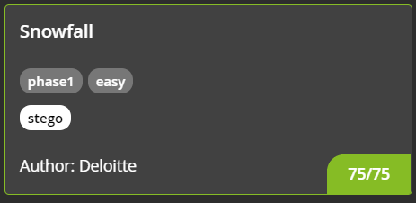
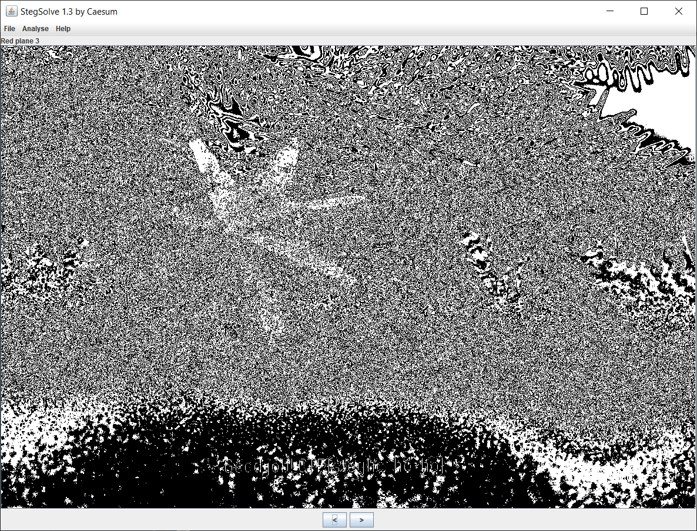

#### CHALLENGE INFORMATION

Such beautiful christmas scenery! .. But maybe it's concealing a secret message?

*Author information: This challenge is developed by Deloitte.*

#### FILES

You will need the files below in order to solve this challenge.

[snowfall.png](./img/snowfall.png)

#### (75 Points) SNOWFALL

Such beautiful christmas scenery! .. But maybe it's concealing a secret message?

*Note: the flag does not have spaces (only underscores).*

---

#### (Solution) SNOWFALL

Original:


Using [stegsolve](https://github.com/zardus/ctf-tools/blob/master/stegsolve/install) we can get the flag:



Flag:

```
CTF{stegho_ho_ho}
```

