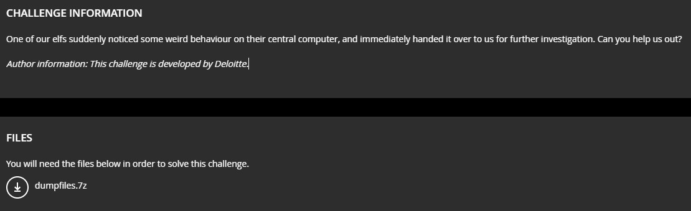
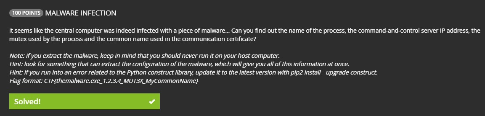
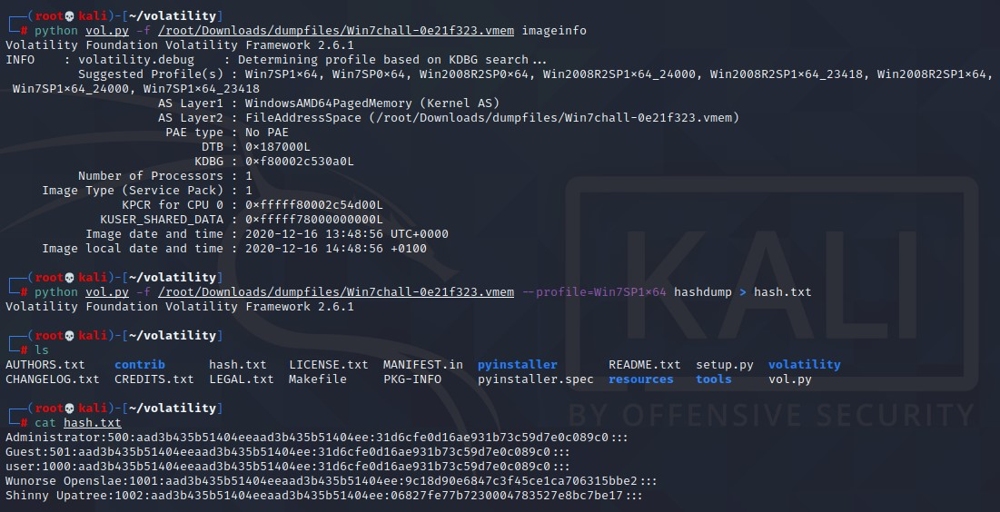
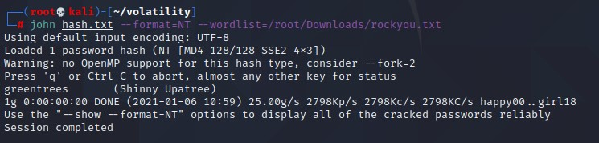
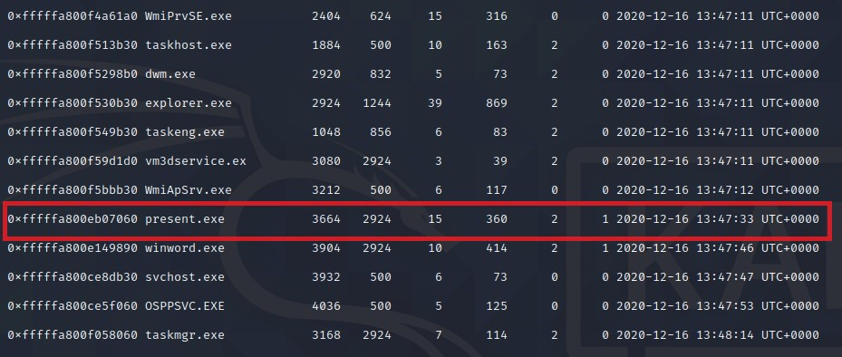
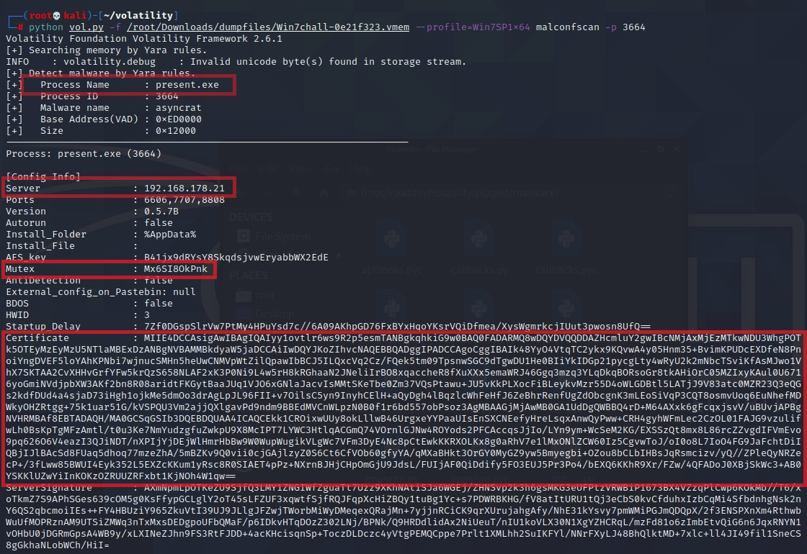
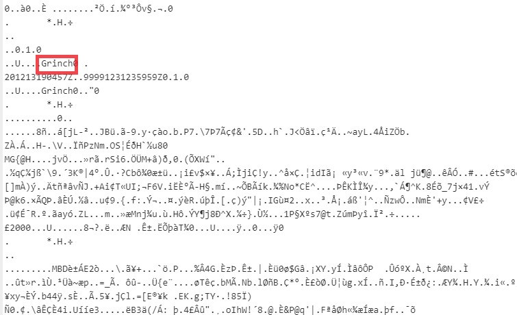

# Memory Like An Elf
Category: Forensics  
Level: Easy/Medium  
Author: Deloitte

---

### Challenge:



There are actually 5 subtask for this challenge but we only managed to solve 2 of them which is below image:




<br/>

### Solution:

First, download the dumpfiles.7z and extract the files inside to get the .vmem file for the later forensics part.

To solve the password of Shinny Upatree, we need to do a hashdump of the users account and then crack the hash using John the Ripper cracking tool. To do the hashdump, we will employ the volatility tool.

*Note: if encounter issue with the volatility tool or when using the hashdump plugin, refer to [this medium article to resolve.](https://alvinisonline.medium.com/volatility-importerror-no-module-named-crypto-hash-e515092fd8e3) Hashdump requires the pycrypto package to work properly.* 

Commands to run to get the hashdump as below:

- to find out the profile (operating system) that was in use
```bash
python vol.py -f /root/Downloads/dumpfiles/Win7chall-0e21f323.vmem imageinfo
```


- hashdump plugin to extract the credentials stored in registry and dump into hash.txt
```bash
python vol.py -f /root/Downloads/dumpfiles/Win7chall-0e21f323.vmem --profile=Win7SP1x64 hashdump > hash.txt
```



After that, we will proceed to crack the password using John the Ripper.

I will be using the rockyou.txt wordlist which can be downloaded from https://github.com/brannondorsey/naive-hashcat/releases/download/data/rockyou.txt

Next, run the command and you will get the password for Shinny Upatree.

```bash
john hash.txt --format=NT --wordlist=/root/Downloads/rockyou.txt
```



The flag is:
```
greentrees
```


Up next is to identify the malware residing in the system and gather the information like name of the process, the command-and-control server IP address, the mutex used by the process and the common name used in the communication certificate. 

Flag format is CTF{themalware.exe_1.2.3.4_MUT3X_MyCommonName}

Thanks to the hint telling us to look for something that can extract the configuration of malware that will gives us all the information we needed, a quick search in google return us a plugin for volatility called MalConfScan which can be found here: https://github.com/JPCERTCC/MalConfScan.

Thus, install the plugin following their wiki page, https://github.com/JPCERTCC/MalConfScan/wiki/how-to-install.

Run the command `python vol.py -f /root/Downloads/dumpfiles/Win7chall-0e21f323.vmem --profile=Win7SP1x64 pslist` to display a list of the running processes. Scrutinizing through the list, we managed to identify a process (present.exe) that looks very suspicious as the name was not a common process. Refer to image below:



Thus, we run the process ID 3664 against the MalConfScan plugin and yields the below information and we know we got our answer. The 4 parts of the flag that we need is highlight in red box, however some work still needs to be done for the last part which is the certificate. 



The certificate is base64 encoded thus we use some online decoder to help us to decode and get the last part of the flag as below:




Hence, the flag is:
```
CTF{present.exe_192.168.178.21_Mx6SI8OkPnk_Grinch}
```