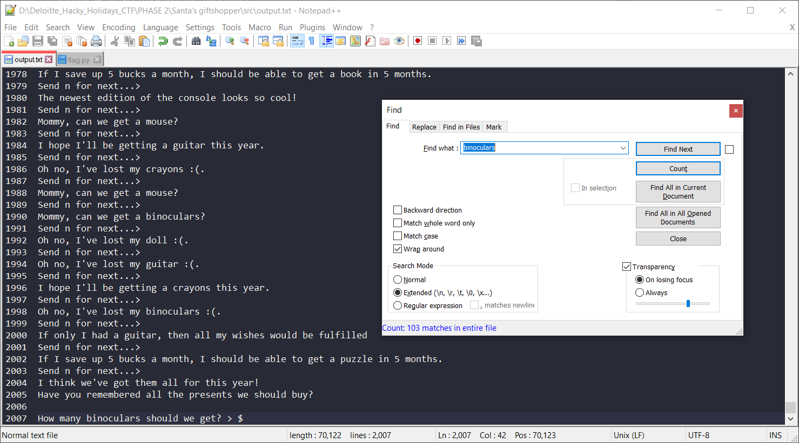

#### CHALLENGE INFORMATION

Santa lost his notebook, can you keep notes for him while shopping for Christmas presents?

*Author information: This challenge is developed by Deloitte.*

#### BACKEND SYSTEMS

Backend systems are running for you.
This environment will run until 2021-01-03 16:08:36 CET

Use the following link to access the challenge:
[tcp://portal.hackazon.org:17005](unsafe:tcp://portal.hackazon.org:17005)

#### (100 POINTS) NOTEKEEPER

Santa lost his notebook, can you keep notes for him while shopping for Christmas presents?

---

#### (Solution) NOTEKEEPER

Since it is TCP, we can use NetCat to access the server:

```
$ nc portal.hackazon.org 17005
```

Output:

```

                 ___
         /`   `'.
        /   _..---;
        |  /__..._/  .--.-.
        |.'  e e | ___\_|/____
       (_)'--.o.--|    | |    |
      .-( `-' = `-|____| |____|
     /  (         |____   ____|
     |   (        |_   | |  __|
     |    '-.--';/'/__ | | (  `|
     |      '.   \    )"";--`\ /
     \        ;   |--'    `;.-'
     |`-.__ ..-'--'`;..--'`

   ___      _        __    _       ___    _                _ __    _ __
  / __|    (_)      / _|  | |_    / __|  | |_      ___    | '_ \  | '_ \   ___      _ _
 | (_ |    | |     |  _|  |  _|   \__ \  | ' \    / _ \   | .__/  | .__/  / -_)    | '_|
  \___|   _|_|_   _|_|_   _\__|   |___/  |_||_|   \___/   |_|__   |_|__   \___|   _|_|_
_|'''''|_|'''''|_|'''''|_|'''''|_|'''''|_|'''''|_|'''''|_|'''''|_|'''''|_|'''''|_|'''''|
"'-0-0-'"'-0-0-'"'-0-0-'"'-0-0-'"'-0-0-'"'-0-0-'"'-0-0-'"'-0-0-'"'-0-0-'"'-0-0-'"'-0-0-'


Santa lost his notebook.

Can you keep track of the 1000 children's wishes
while he's doings his rounds?

I hope I'll be getting a guitar this year.
Send n for next...>
```

Let's press `n` a couple of times.

```
Send n for next...> n

I hope I'll be getting a doll this year.
Send n for next...> n

Oh no, I've lost my racecar :(.
Send n for next...> n

I hope I'll be getting a mouse this year.
Send n for next...> n

I hope I'll be getting a puzzle this year.
Send n for next...> n

Oh no, I've lost my console :(.
Send n for next...> n

Oh no, I've lost my binoculars :(.
Send n for next...> n

Oh no, I've lost my console :(.
Send n for next...> n

The newest edition of the mouse looks so cool!
Send n for next...> n

Mommy, can we get a racecar?
Send n for next...> n

The newest edition of the binoculars looks so cool!
Send n for next...> n

If only I had a puzzle, then all my wishes would be fulfilled
Send n for next...> n

The newest edition of the console looks so cool!
Send n for next...> n

If I save up 5 bucks a month, I should be able to get a console in 5 months.
Send n for next...>
```

Maybe the hint is we need to press `n` a 1000 times. Let's do a bit of recon first. So I wrote a simple Python script that prints `n` a 1000 times.

```python
# n1000.py
for i in range(1000):
    print('n')
```

We then pipe it to the server.

```
$ python3 n1000.py | nc portal.hackazon.org 17005
```

Indeed, the last at the end, it asked for the following:

```
How many guitar should we get? >
```

Note: your output may defer as the information are random.

At this stage I will use `pwntools` (https://github.com/arthaud/python3-pwntools) to send 1000 `n` responses and set it to interactive mode [(flag.py)](./src/flag.py)

```python
from pwn import *

host = 'portal.hackazon.org'
port = 17005

# Set up a remote connection
r = remote(host, port)

# Send 1000 * n responses
for i in range(1000):
    r.send("n\n")

# Receive responses
print(r.recv())

# Start interactive mode
r.interactive()
```

Output:


Let's select all and copy paste the output to a text file: [output.txt](./src/output.txt)



Take note of the following:

- For the first question, we need minus 1 instance from the count result itself to get 103 binoculars (your question might be different here.
- Subsequent, questions, we can read it off directly
- Also, if the question ask for "book", we need to minus an additional 1 because of the word "notebook".

Enter the values as requested to get the flag:


Flag:

```
CTF{S4nt4-H4s-4-B4d-M3m0ry}
```

